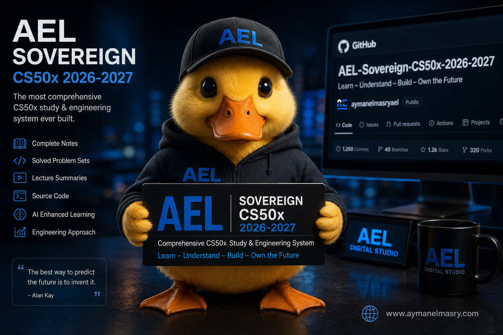

# 🏛️ AEL Sovereign CS50x Citadel (2026-2027)
**Sovereign Computer Science Encyclopedia & Multi-Wing Execution Engine**

<p align="center">
  
</p>


---

## 🌟 Sovereign Executive Summary
This enterprise repository represents the ultimate architectural synthesis of **Harvard CS50x 2026-2027** and the **AEL Sovereign Execution Paradigm** engineered by **Ayman Elmasry** (AI Prompt Engineer & Computational Creative Director). 

Designed to operate as a high-performance single-page application (SPA) citadel, this platform integrates interactive academic assessment, real-time code sandboxing, zero-trust AI prompt engineering, and active cryptographic DOM verification.

---

## 🏛️ Master Citadel Wings

### 1. 🔘 Master Dashboard (`docs.html`)
The root navigational hub of the entire encyclopedia. Fully mapped with restored absolute and relative bindings, persistent SHA-256 biometric integrity checking, and dynamic theme handling.

### 2. 🎓 Master Exams & Solutions Citadel (`cs50x_exams_and_solutions.html`)
Comprehensive coverage of all 11 weeks of the CS50x curriculum (**Week 0 Scratch to Week 10 The End**). Features:
* **Flawless Expert Solutions:** Real CS50 exam bugs diagnosed with perfect production-grade C, Python, SQL, and Web corrections.
* **Master Interactive Simulator:** 11 active simulation questions providing instantaneous JavaScript assessment and LaTeX-rendered asymptotic Big-Theta analysis.
* **Raw Formats Hub:** One-click clipboard copy and direct download engine for all solutions across `Pure JSON`, `Pure Plain Text`, `Pure HTML`, and `Pure Markdown`.

### 3. 💻 Live WebAssembly IDE (`cs50x_live_ide.html`)
A fully embedded, zero-install execution playground:
* **Pyodide Virtual Machine:** Compiles and executes Python 3 code directly inside the browser using WebAssembly.
* **C & Valgrind Forensics Simulation:** Evaluates heap allocation, memory leak checks, and pointer arithmetic dynamically.
* **Instant Presets:** Integrated quick-loaders for DNA sequencing loops and SQLite bank fraud investigations.

### 4. 🤖 AI Prompt Engineering Wing (`cs50x_ai_prompt_engineering.html`)
A professional showcase for elite artificial intelligence integration:
* **Socratic Tutor System Prompt:** Enforces strict pedagogical guidelines preventing AI models from leaking direct code answers.
* **Zero-Trust AI Firewall:** Hardened defense meta-instructions thwarting prompt injection attacks, roleplay jailbreaks (`DAN Mode`), and prompt leaking.
* **AEL Quantum Hyperparameters:** Production JSON preset tuned to `temperature 0.15` and `top_p 0.85` for flawless analytical reasoning.

### 5. ⚡ AI Command Palette (`ael_sovereign_cmd_k.js`)
An elegant floating command launcher triggered instantly by pressing `Cmd + K` or `Ctrl + K`. Implements high-speed fuzzy search across the entire repository to navigate directly to specific exam wings or resources.

---

## 🚀 CI/CD & Global Deployment Architecture

### Docker Production Container (`Dockerfile`)
Built on a multi-stage **NGINX Alpine** image configured for extreme speed and security. Includes gzip compression and enterprise security headers (`Content-Security-Policy`, `X-Frame-Options`, `X-XSS-Protection`).

```bash
# Build the production container locally
docker build -t ael-cs50x-citadel .

# Run the containerized citadel on port 8080
docker run -p 8080:80 ael-cs50x-citadel
```

### GitHub Actions Deployment Pipeline
This repository contains a dedicated continuous integration workflow (`.github/workflows/ael_sovereign_deploy.yml`) that automatically:
1. Validates the Docker container build against NGINX standards.
2. Deploys the static web root directly to **GitHub Pages** upon pushing to the `main` or `master` branch.

---

## 🔒 AEL Sovereign Seal & Legal Entities
```json
{
  "ael_seal": "AEL CS Encyclopedia — © Ayman Elmasry",
  "owner": "Ayman Elmasry",
  "legal_entities": [
    "Ayman Elmasry LLC (UAE)",
    "Ayman Elmasry Advertising & Marketing (Egypt)"
  ],
  "syllabus_source": "Harvard CS50x 2026-2027",
  "methodology": "8-Stage Sub-Silicon Execution Paradigm",
  "system_version": "v3.0"
}
```

---
*Built with unyielding dedication to computational excellence by Ayman Elmasry.*
