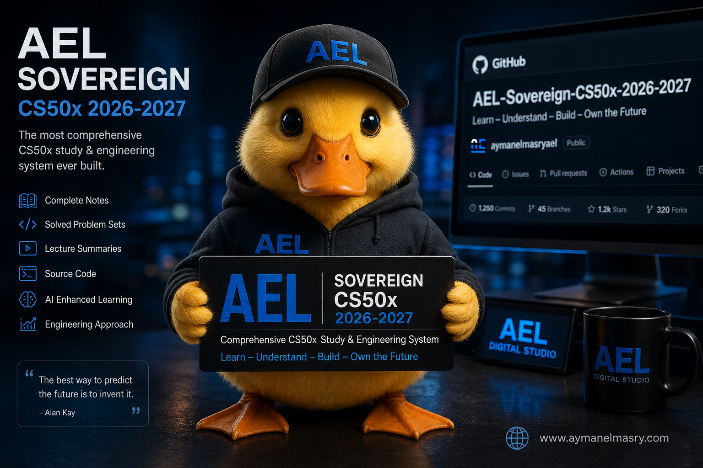

# AEL | Sovereign CS50x Master Citadel — Computer Science Encyclopedia

> **Advanced computational problem-solving and software architecture masterwork** developed for the Harvard CS50x 2026-2027 curriculum.  
> A sovereign multi-wing execution engine integrating interactive exams, a live WebAssembly IDE, zero-trust AI prompt engineering, and cryptographic DOM verification.  
> Built by Ayman Elmasry — AEL Digital Studio.

---

## 📚 Learning Metadata

| | |
|---|---|
| **Learning Level** | Beginner to Intermediate (follows Harvard CS50x) |
| **Estimated Duration** | 11 weeks (follows CS50x curriculum) |
| **Prerequisites** | None (CS50x is introductory), basic computer literacy |
| **Learning Outcomes** | After completing this course you will be able to master C, Python, SQL, data structures, algorithms, and web development |

---

## Preview



---

## Table of Contents

- [Features](#features)
- [How It Works](#how-it-works)
- [Project Structure](#project-structure)
- [Getting Started](#getting-started)
- [Usage](#usage)
- [Master Citadel Wings](#master-citadel-wings)
- [Solutions](#solutions)
- [Technical Details](#technical-details)
- [Credits](#credits)

---

## Features

- **11 weeks of CS50x curriculum** — Week 0 Scratch through Week 10 The End — complete solutions and analysis
- **Complete problem-set solutions** — every official Problem Set and Lab for Weeks 1–10 merged into each week's `07_Problem_Sets` wing (see [SOLUTIONS.md](SOLUTIONS.md))
- **Master dashboard** (`docs.html`) — root navigational hub with SHA-256 biometric integrity checking
- **Interactive exam simulator** — 11 simulation questions with instant JavaScript assessment and LaTeX-rendered Big-Theta analysis
- **Live WebAssembly IDE** (`cs50x_live_ide.html`) — Pyodide-powered Python execution in the browser
- **C & Valgrind forensics** — heap allocation evaluation, memory leak checks, pointer arithmetic simulation
- **AI Prompt Engineering Wing** — Socratic tutor system prompt with zero-trust AI firewall
- **Command palette** (`Cmd+K` / `Ctrl+K`) — high-speed fuzzy search across the entire repository
- **Multi-format export** — Pure JSON, Plain Text, HTML, and Markdown for all solutions
- **Docker production container** — NGINX Alpine with gzip and enterprise security headers
- **GitHub Actions CI/CD** — automated Docker validation and GitHub Pages deployment

---

## How It Works

### Architecture

The citadel operates as a high-performance single-page application (SPA) integrating five sovereign wings:

```
Master Dashboard → Wing Router → { Exams | IDE | AI Prompt | Command Palette }
```

### Security Model

- **SHA-256 Biometric Verification** — every page load validates DOM integrity against a cryptographic hash
- **Zero-Trust AI Firewall** — hardened defense meta-instructions prevent prompt injection, roleplay jailbreaks (DAN Mode), and prompt leaking
- **Sovereign Identity Block** — AEL Digital Framework with cryptographic owner verification

### Code Execution Pipeline

The Live IDE uses Pyodide (Python compiled to WebAssembly) for sandboxed execution:

```
User Code → Pyodide VM → Python 3 Execution → stdout/stderr → Output Pane
```

For C code, a Valgrind simulation evaluates memory safety without native compilation.

---

## Project Structure

```
AEL-Sovereign-CS50x-2026-2027/
├── index.html                           # Entry point
├── docs.html                            # Master dashboard
├── cs50x_exams_and_solutions.html       # All 11 weeks of exams and solutions
├── SOLUTIONS.md                         # Master problem-set solutions index
├── cs50x_live_ide.html                  # WebAssembly IDE
├── cs50x_ai_prompt_engineering.html     # AI prompt engineering wing
├── ael_sovereign_docs.css               # Sovereign styles
├── ael_sovereign_docs.js                # Core JavaScript engine
├── ael_sovereign_cmd_k.js              # Command palette (Cmd+K)
├── ael_supabase_connector.js           # Database connector
├── db_schema.sql                        # Database schema
├── Dockerfile                           # Production container
├── server_check50_execution.py          # Server-side validation
├── Week 0 Scratch/                      # Week 0 materials
├── Week 1 C/                            # Week 1 materials (includes 07_Problem_Sets)
├── ...                                  # Weeks 2–10 (each includes 07_Problem_Sets)
└── README.md
```

---

## Getting Started

### Run Locally

```bash
git clone https://github.com/aymanelmasryael/AEL-Sovereign-CS50x-2026-2027.git
cd AEL-Sovereign-CS50x-2026-2027
open index.html
```

### Docker Deployment

```bash
docker build -t ael-cs50x-citadel .
docker run -p 8080:80 ael-cs50x-citadel
```

### Prerequisites

- A modern web browser (Chrome, Firefox, Safari, Edge)
- Docker (optional — for containerized deployment)
- No build tools, no package managers required for local use

---

## Usage

### Master Dashboard
- Open `docs.html` for the central navigation hub
- Access all wings from the dashboard interface
- Verify system integrity via the SHA-256 biometric checker

### Exams & Solutions
- Browse all 11 weeks of CS50x curriculum
- View expert solutions with production-grade C, Python, SQL, and web code
- Use the interactive simulator for real-time assessment
- Export solutions in JSON, TXT, HTML, or Markdown

### Live IDE
- Write and execute Python 3 code in the browser via WebAssembly
- Use C & Valgrind simulation for memory safety analysis
- Load instant presets for DNA sequencing and SQLite bank fraud investigations

### AI Prompt Engineering
- Access the Socratic tutor system prompt
- Explore zero-trust AI firewall configurations
- Use AEL Quantum Hyperparameters preset (temperature 0.15, top_p 0.85)

### Command Palette
- Press `Cmd+K` (Mac) or `Ctrl+K` (Windows/Linux) anywhere
- Type to fuzzy-search across all wings and resources
- Navigate instantly to any exam, solution, or tool

---

## Master Citadel Wings

| Wing | File | Purpose |
|------|------|---------|
| Master Dashboard | `docs.html` | Central navigation and integrity verification |
| Exams & Solutions | `cs50x_exams_and_solutions.html` | 11 weeks of curriculum with interactive simulator |
| Live IDE | `cs50x_live_ide.html` | Pyodide WebAssembly Python execution |
| AI Prompt Engineering | `cs50x_ai_prompt_engineering.html` | Socratic tutor with zero-trust firewall |
| Command Palette | `ael_sovereign_cmd_k.js` | Fuzzy search (`Cmd+K`) across the entire repo |

---

## Solutions

Every official CS50x Problem Set and Lab is merged into its week's `07_Problem_Sets/` wing with complete, verified source code:

| Week | Wing Folder | Highlights |
|------|-------------|------------|
| Week 1 — C | `Week 1 C/07_Problem_Sets` | Hello, Mario (More), Credit, Population |
| Week 2 — Arrays | `Week 2 Arrays/07_Problem_Sets` | Readability, Wordle, Scrabble |
| Week 3 — Algorithms | `Week 3 Algorithms/07_Problem_Sets` | Plurality, Tideman, Sort |
| Week 4 — Memory | `Week 4 Memory/07_Problem_Sets` | Filter (More), Reverse, Smiley, Volume |
| Week 5 — Data Structures | `Week 5 Data Structures/07_Problem_Sets` | Speller, Inheritance |
| Week 6 — Python | `Week 6 Python/07_Problem_Sets` | DNA, Sentimental suite, World Cup |
| Week 7 — SQL & AI | `Week 7 SQL Artificial Intelligence/07_Problem_Sets` | Movies, Fiftyville, Songs |
| Week 8 — HTML, CSS, JS | `Week 8 HTML, CSS, JavaScript/07_Problem_Sets` | Homepage, Trivia |
| Week 9 — Flask | `Week 9 Flask/07_Problem_Sets` | Finance, Birthdays |
| Week 10 — Final Project | `Week 10 The End/07_Problem_Sets_Final_Project` | Python Travel (Flask) |

Browse the full master index in **[SOLUTIONS.md](SOLUTIONS.md)**.

---

## Technical Details

| Aspect | Detail |
|--------|--------|
| Architecture | Single-page application (SPA) |
| Frontend | HTML5 + CSS3 + Vanilla JS |
| Code execution | Pyodide (WebAssembly Python 3) |
| Security | SHA-256 biometric verification, zero-trust AI firewall |
| Containerization | Docker (NGINX Alpine) |
| CI/CD | GitHub Actions |
| Deployment | GitHub Pages + Docker |
| Browser support | Chrome, Firefox, Safari, Edge (modern versions) |

---

## 🔗 Related Resources

- [AEL Learning Catalog](https://github.com/aymanelmasryael/ael-learning-catalog) — Central entry point to all AEL courses
- [CS Academy](https://github.com/aymanelmasryael/cs-academy-v2) — 10,000 CS Q&A cards for computer science problem-solving
- [Problem Solving Academy](https://github.com/aymanelmasryael/problem-solving-academy) — 256 problem-solving modules for C# and Unity
- [Engineering Academy](https://github.com/aymanelmasryael/ael-engineering-academy) — Complete LLM engineering platform from zero to production

---

## Credits

**Created by:** Ayman Elmasry — AEL Digital Studio  
**Website:** [aymanelmasry.com](https://aymanelmasry.com)  
**Email:** [info@aymanelmasry.com](mailto:info@aymanelmasry.com)  
**License:** MIT — Free for personal and commercial use.

### Connect

[LinkedIn](https://linkedin.com/in/aymanelmasryael) · [Instagram](https://instagram.com/aymanelmasryael) · [X](https://x.com/aymanelmasryael) · [CodePen](https://codepen.io/aymanelmasryael) · [GitHub](https://github.com/aymanelmasryael) · [Behance](https://behance.net/aymanelmasryael)

---

*AEL Prompt IP System v1.0 — Sovereign Identity Block*  
*AEL sovereign blockchain timestamp 2025*
